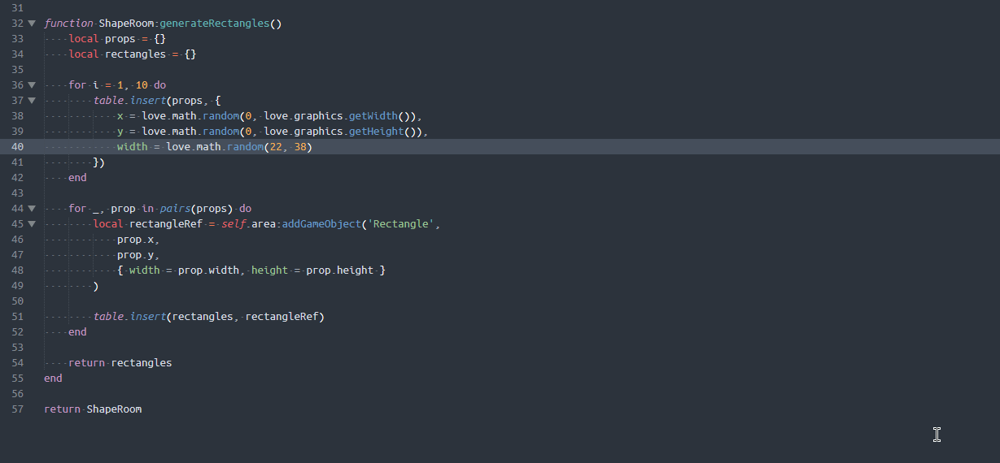

# LÖVELY2D



A (WIP) Sublime Text 4 plugin for LÖVE2D development that provides autocomplete and API information.

Based on [LÖVE-API](https://github.com/love2d-community/love-api).

## Installation

### Package Control

LÖVELY2D is available on [Package Control](https://packagecontrol.io/packages/LOVELY2D).

### Manually

1. Navigate to your `Packages` folder (easiest way to find it is from within Sublime Text, go to `Preferences > Browse Packages...`).
2. Download the latest release from the [releases page](https://github.com/kevinfiol/LOVELY2D/releases).
3. Unzip the downloaded archive. Copy the directory `LOVELY2D-x.x.x` into your `Packages` folder.

### With Git

Use `git clone` to clone this repository into your `Packages` folder.

```bash
# From within your `Packages` folder
git clone https://github.com/kevinfiol/LOVELY2D.git
```

## Usage

From within a `.lua` file, set the syntax to `LOVELY2D`. Autocomplete and hover tips should function normally.

*Tip:* I recommend setting `"auto_complete_preserve_order": "none"` in your Sublime preferences for more predictable auto-complete behavior.

### Usage with Sublime LSP

[Sublime LSP](https://github.com/sublimelsp/LSP) is an implementation of the Language Server Protocol for Sublime Text. You can use it in conjunction with LÖVELY2D for an even better LÖVE2D development experience.

1. Install [Sublime LSP](https://packagecontrol.io/packages/LSP).
2. Install [LSP-lua](https://packagecontrol.io/packages/LSP-lua)
3. Open the Command Palette, and go to `LSP-lua Settings`. Modify the `selector` and `Lua.diagnostics.globals` property so that LÖVELY2D Syntax files are correctly parsed and diagnostics doesn't nag you about the `love` global. Example:

```json
// Settings in here override those in "LSP-lua/LSP-lua.sublime-settings"
{
    "selector": "source.lovely | source.lua",
    "settings": { "Lua.diagnostics.globals": ["love"] }
}
```

## Known Issues / To-Do

* (Bug) Invoking the API popup on anything under the `love.` namespace closes the autocomplete. This is unintended, and I'm not sure why it happens (help appreciated!)
* Function override signatures not provided in hints
* Hover tips are sometimes overridden by Reference tips
* General clean-up / commenting
* ~~Implement function signature helper while typing in parameters~~ *(Added in 0.6.0)*
